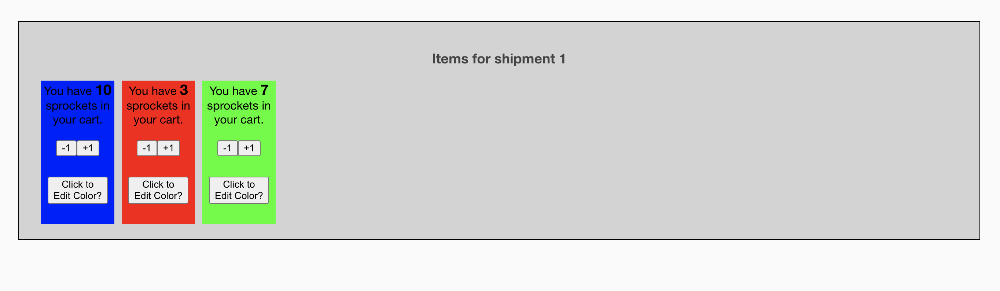

# Objective
This is an experimental repo for playing with different ways of setting up a mono reposiotry to work with dynamically imported components at build and runtime.


# Project
Spacely is an imaginary intergalactic sprocket manufacturer. Spacely sales sprockets and only sprockets. Users can go to their sales page and order a finite number of sprockets. Sprockets can come in many colors and over time, spacely would like to allow customers to pick their colors.


To do this the spacely organization has an inventory object.

```ts
interface Inventory{
    count: number, // should be a number greater than 0
    color: string // should start with "#"
}
```

The sales application is simply a way of tracking the number of sprockets of a specific color you want.


# Project Organization

We want to separate the application from various packages. Packages may have utility outside of the primary sales application and Spacely is very big on reusing code across its many applications.

The codebase has two upper level directories: `Apps` and `packages`.

Inside `packages` go modules and components that we wish to be reused. To start with Spacely has two key packages.
1. inventory: this is the state of an inventory object along with actions to mutate state.
2. inventory-views: components specifically tailored to the inventory type.

Inside `apps` we'll have two applications: 1 - sales application, and 2 - Jetsons application.


# Imaginary workflow
1 - Spacely builds out its flagship sales app, but puts reusable state and state rendering components in separate packages.


2 - Spacely product team "Jetson" works really hard on making sprockets of different colors and exposes a component to edit the color of any sprocket in its inventory. 


3 - Jetson deploys their own application with module federation supported. In this case, Jetson exposes a sprocket inventory color picker called `SprocketColor`.

    Let's say Jetsons application is living at `http://localhost:3000`
    


4 - Spacely sales team realizes they want to update their order card with this component, but only if their users want to actually edit the color.

    Let's pretend the `SprocketColor` component is really big and is only used by a fraction of shoppers.
    Spacely will dynamically import `SprocketColor` conditionally inside their Order card component and pass in whatever state it needs.


5 - Voilla, `SprocketColor` is available in Spacely's app:
    - Spacely did not have to add jetsons app as a dependency, just to use one of its components
    - Spacely did not have to bundle jetsons app component in its own bundle
    - any changes Jetson makes to the `SprocketColor` component in their app, will automatically be fetched by Spacely sales app.


# Run it
1. Build Jetson's app
```bash
$ npx nx build jetson
```

2. Serve Jetson's built app on port 3000 (this could be any IP or domain)
```bash
$ npx serve -C -p 3000 dist/apps/jetson
```
Note, the `-C` flag is to allow CORS

3. Serve Spacely's app in development mode
```bash
npx nx serve sales
```

You should now see the integrated application at `http://localhost:4200`




